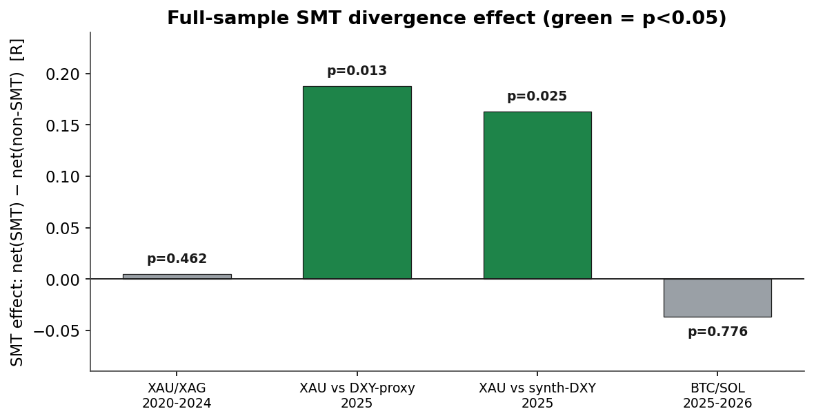
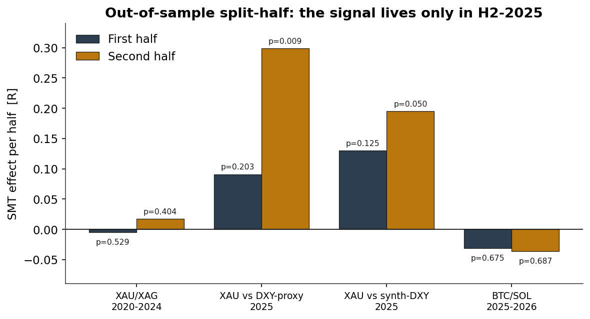
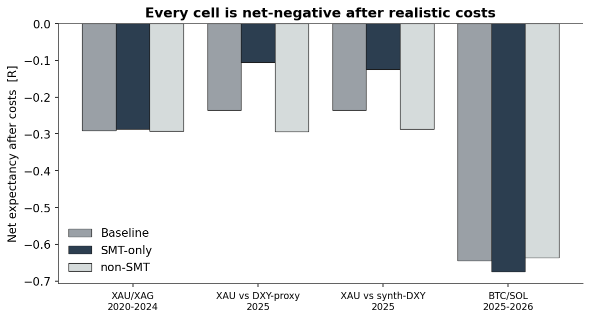
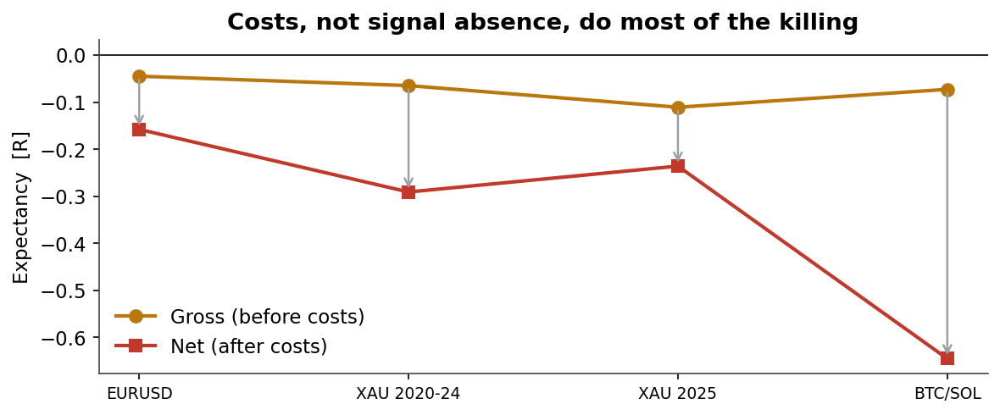

# Turtle Soup + SMT: A Pre-Registered Falsification

**Does a cross-asset SMT divergence filter add real edge to a CRT / Turtle-Soup liquidity-sweep strategy?**
Four pre-registered tests across FX, metals, and crypto. Short answer: **no surviving edge.**

> **Part of a larger falsification arc.** The crypto-microstructure half of this work — order flow, liquidations + OI, CVD divergence, funding, FVG, calendar effects across BTC/ETH/SOL/gold/oil — lives in [retail-crypto-alpha](https://github.com/Mykola-Quant/retail-crypto-alpha). Same discipline: default = no edge, costs charged, out-of-sample confirmation required.

---

## TL;DR

A popular discretionary playbook — a higher-timeframe **CRT** range, a **Turtle Soup** sweep of a key level, and a **SMT divergence** against a correlated instrument as confirmation, traded inside session killzones — was made fully mechanical and tested honestly. The question was narrow on purpose: *does the SMT filter add expectancy, or just shrink the sample?*

| # | Test | Data | Full-sample p | Out-of-sample verdict |
|---|------|------|:---:|---|
| 1 | XAU/XAG (gold vs silver) | 2020–2024 | 0.46 | ❌ no effect |
| 2 | XAU vs DXY-proxy | 2025 | 0.013 | ❌ H1 fails (p=0.20) |
| 3 | XAU vs synthetic DXY | 2025 | 0.025 | ❌ H1 fails (p=0.13) |
| 4 | BTC vs SOL (crypto) | 2025–2026 | 0.78 | ❌ no effect |

Every test fails. The baseline Turtle-Soup pattern is net-negative after costs everywhere. Where the SMT filter *did* test significant (gold vs the dollar), the effect was **concentrated entirely in the second half of 2025** and did not replicate on five untouched prior years (p=0.46) or on a different asset class (p=0.78). The apparent signal is a **regime fingerprint, not a stable edge**.

## Why this is worth publishing

This isn't a "+200% backtest." It's the opposite, and that's the point. The repo demonstrates a disciplined falsification workflow that most retail strategy testing skips:

- **Pre-registration.** Every threshold (sweep buffer, costs, the OOS pass criterion) was fixed *before* results were seen. No tuning against the test set.
- **Costs taken seriously.** 0.5 pip RT on FX, broker-style on metals, a conservative **0.13% RT on crypto**. Costs, not signal absence, do most of the killing.
- **Distribution-free significance.** A 10,000-shuffle permutation test for the SMT effect, plus a bootstrap 95% CI on net expectancy.
- **A decisive out-of-sample test, specified in advance.** Split the ledger at the calendar midpoint; the effect survives *only* if both halves show positive delta and p < 0.10. This single rule killed three "significant" full-sample results.

## The strategy, made mechanical

- **CRT range** — the prior completed 4 h candle defines CRT high / CRT low (the key liquidity levels).
- **Turtle Soup** — price pokes beyond a key level by a fixed buffer, then closes back inside within the same bar → sweep.
- **SMT divergence** — a correlated instrument fails to confirm the sweep (e.g. gold makes a new high while the dollar fails to make a new low).
- **Time** — London + NY-AM killzones on FX/metals; 24/7 on crypto.
- **Model #1** — entry on the reclaim close, stop beyond the sweep extreme, fixed 2R target.

## Key figures

| | |
|---|---|
|  |  |
| **Fig 1** — full-sample SMT effect; only gold-vs-dollar is significant | **Fig 2** — the signal lives only in H2-2025 |
|  |  |
| **Fig 3** — every cell net-negative after costs | **Fig 4** — costs subtract ~0.57R/trade on crypto |

## Reproduce it

```bash
python -m venv .venv && source .venv/bin/activate
pip install pandas numpy pyarrow matplotlib

# 1. Convert HistData 1-min ASCII -> clean UTC parquet (year-filterable)
python convert_histdata.py XAUUSD xauusd_2020_2024.parquet 2020 2024
python convert_histdata.py XAGUSD xagusd_2020_2024.parquet 2020 2024

# 2. (optional) build the dollar partner for the SMT test
python build_dxy_proxy.py eurusd_1m.parquet dxy_proxy_1m.parquet
python build_synthetic_dxy.py --out dxy_synth_1m.parquet   # full 6-pair ICE index

# 3. Run a pre-registered test (prints baseline, SMT, permutation, bootstrap, OOS)
python crt_turtlesoup_smt_backtest.py \
    --primary xauusd_2020_2024.parquet --secondary xagusd_2020_2024.parquet \
    --asset xauusd --smt-mode positive
```

Each run prints the full result block including the pre-registered out-of-sample verdict.

## Repo structure

```
crt_turtlesoup_smt_backtest.py   # engine: CRT, Turtle Soup, SMT, fixed-R sim,
                                 #   permutation + bootstrap + split-half OOS
convert_histdata.py              # HistData M1 ASCII -> UTC parquet, year filter
build_dxy_proxy.py               # quick dollar proxy = 1/EURUSD (correct OHLC swap)
build_synthetic_dxy.py          # full ICE DXY from 6 pairs
make_charts.py                   # regenerate the figures
report/                          # PDF research report
figures/                         # PNG charts
```

## Data sources

- **FX & metals:** free 1-minute bars from [HistData.com](https://www.histdata.com) (ASCII M1).
- **Crypto:** Binance 5-minute OHLC.

## Honest limitations

Costs are modelled, not broker-exact (metals are conservative placeholders). Killzone hours are not yet DST-adjusted — though no session showed positive net expectancy regardless. Exits use a fixed 2R bracket; a CRT-liquidity target could reshape the distribution but not the central finding that the SMT *filter* adds no stable edge.

## Context

This is the final chapter of a longer falsification arc — earlier rounds tested SMC sweep patterns, opening-FVG directional theses, and 1-minute order-flow signals (momentum / absorption / liquidation cascades) on crypto, all of which were falsified after costs. Same methodology throughout: pre-register, separate descriptive from tradable, apply real costs, reject what fails an honest test.

---

*Methodology over outcome. The value here is a process that a real trading edge is supposed to survive — and this one didn't.*
